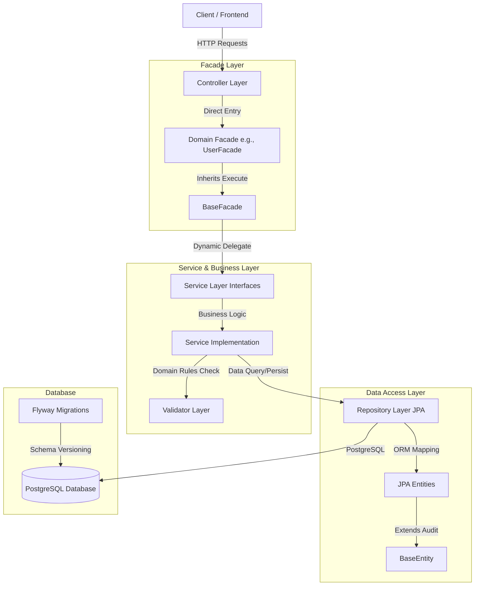

# Kiến Trúc Hệ Thống Backend (Divvy App)

Tài liệu này mô tả chi tiết kiến trúc, mô hình tổ chức source code và luồng dữ liệu của hệ thống backend Divvy.

---

## 1. Sơ đồ Kiến trúc Tổng quan (Architecture Diagram)

Hệ thống được thiết kế theo mô hình **Layered Architecture** kết hợp với **Facade Pattern** phân cấp (BaseFacade -> DomainFacade) nhằm mục đích decoupling tối đa giữa các Layer.



---

## 2. Mô tả các Layer (Layer Breakdown)

### 2.1. Controller Layer (`com.hcmut.divvy.controller`)
*   **Nhiệm vụ:** Tiếp nhận HTTP requests, xử lý validation đầu vào bằng `jakarta.validation.constraints` (thông qua `@Valid`), và trả về cấu trúc response đồng nhất `ApiResponse<T>`.
*   **Nguyên tắc:** **100% Facade-Centric**. Controllers không được phép tự inject trực tiếp các Service cụ thể. Tất cả các service calls (kể cả CRUD đơn giản hay nghiệp vụ phức tạp) đều được điều phối qua Facade tương ứng (ví dụ: `UserFacade`).
*   **Ví dụ:** [UserController](file:///e:/WORKSPACE/PROJECT_WEB/khoi-nghiep/backend/main/src/main/java/com/hcmut/divvy/controller/UserController.java)

### 2.2. Facade Layer (`com.hcmut.divvy.facade`)
*   **Nhiệm vụ:** Cung cấp điểm tiếp nhận duy nhất cho Controller theo từng domain cụ thể.
*   **Cấu trúc kế thừa:**
    *   [BaseFacade](file:///e:/WORKSPACE/PROJECT_WEB/khoi-nghiep/backend/main/src/main/java/com/hcmut/divvy/facade/BaseFacade.java): Chứa `ApplicationContext` và cung cấp hai phương thức generic `execute` và `executeVoid` để tự động phân giải các Service Bean động từ Spring container.
    *   [UserFacade](file:///e:/WORKSPACE/PROJECT_WEB/khoi-nghiep/backend/main/src/main/java/com/hcmut/divvy/facade/UserFacade.java): Kế thừa `BaseFacade`, đại diện cho phân vùng xử lý User. Đây là nơi chứa logic điều phối phức tạp liên quan đến User và các service khác sau này.
*   **Lợi ích:**
    *   Giảm số lượng dependency cần inject vào Controllers.
    *   Tách biệt hoàn toàn tầng Routing (Controller) và tầng Nghiệp vụ (Service).
    *   Dễ dàng chèn thêm các cross-cutting concerns (logging, transaction auditing, metrics) tại một điểm tập trung duy nhất ở `BaseFacade`.

### 2.3. Service Layer (`com.hcmut.divvy.service`)
*   **Nhiệm vụ:** Định nghĩa business interfaces và thực thi business logic tại lớp Implementations (`com.hcmut.divvy.service.impl`).
*   **Nguyên tắc:** 
    *   Lớp interface đại diện cho contract (Ví dụ: [UserService](file:///e:/WORKSPACE/PROJECT_WEB/khoi-nghiep/backend/main/src/main/java/com/hcmut/divvy/service/UserService.java)).
    *   Lớp implementation thực thi nghiệp vụ, được đánh dấu `@Service` và `@Transactional` (Ví dụ: [UserServiceImpl](file:///e:/WORKSPACE/PROJECT_WEB/khoi-nghiep/backend/main/src/main/java/com/hcmut/divvy/service/impl/UserServiceImpl.java)).
    *   Tương tác với Repositories để đọc/ghi dữ liệu và gọi Validators để kiểm tra nghiệp vụ.

### 2.4. Validator Layer (`com.hcmut.divvy.validator`)
*   **Nhiệm vụ:** Tập trung xử lý các validation mang tính trạng thái hoặc kiểm tra dữ liệu từ database (Ví dụ: kiểm tra trùng lặp email/username, kiểm tra thực thể có tồn tại không).
*   **Mục đích:** Giúp tầng Service luôn tinh gọn, tập trung hoàn toàn vào luồng nghiệp vụ chính thay vị bị phình to bởi các đoạn code `if/else throw new Exception`.

### 2.5. Repository Layer (`com.hcmut.divvy.repository`)
*   **Nhiệm vụ:** Giao tiếp trực tiếp với database. Kế thừa `JpaRepository` của Spring Data JPA.
*   **Ví dụ:** [UserRepository](file:///e:/WORKSPACE/PROJECT_WEB/khoi-nghiep/backend/main/src/main/java/com/hcmut/divvy/repository/UserRepository.java).

### 2.6. Entity Layer (`com.hcmut.divvy.entity`)
*   **Nhiệm vụ:** Khai báo cấu trúc bảng (ORM mapping). Tất cả các entities kế thừa từ [BaseEntity](file:///e:/WORKSPACE/PROJECT_WEB/khoi-nghiep/backend/main/src/main/java/com/hcmut/divvy/common/audit/BaseEntity.java) để tự động quản lý các trường audit (`created_at`, `updated_at`) thông qua JPA Auditing.

---

## 3. Quản lý Database Schema (Database Migrations)

Hệ thống sử dụng **Flyway** để quản lý lịch sử và đồng bộ hóa cấu trúc cơ sở dữ liệu PostgreSQL. Các file SQL migration được đặt tại thư mục [db/migration](file:///e:/WORKSPACE/PROJECT_WEB/khoi-nghiep/backend/main/src/main/resources/db/migration):

1.  `V1__create_core_tables.sql`: Khởi tạo bảng `users`, `currency`, `categories`, `groups`.
2.  `V2__create_group_relations.sql`: Tạo bảng `group_members`, `group_invitations`.
3.  `V3__create_expense_tables.sql`: Tạo các bảng chi tiêu `expenses`, `expense_payers`, `expense_shares`.
4.  `V4__create_debt_and_settlement_tables.sql`: Tạo các bảng công nợ `debts` và thanh toán `settlements`.
5.  `V5__create_activities_table.sql`: Tạo bảng `activities` ghi nhận hoạt động nhóm.
6.  `V6__add_indexes.sql`: Tối ưu hóa truy vấn bằng các index lên các cột FK và trường tìm kiếm thường xuyên.
7.  `V7__seed_reference_data.sql`: Seed dữ liệu cơ bản cho bảng tiền tệ (`currency`) và danh mục (`categories`).

---

## 4. Luồng xử lý một Request mẫu (Request Flow Example)

Khi Client thực hiện gửi request tạo User mới (`POST /api/users`):

```
Client  ──► [Controller: UserController.createUser()]
                 │
                 ▼  (Kiểm tra @Valid CreateUserRequest)
            [Facade: UserFacade.execute(UserService.class, service -> service.create(request))]
                 │
                 ▼  (Phân giải động thông qua BaseFacade -> Spring ApplicationContext)
            [Service: UserServiceImpl.create()]
                 │
                 ├──► [Validator: validate user rules (no duplicate email/username)]
                 │
                 ├──► [Repository: UserRepository.save(User entity)]
                 │
                 ▼  (Mapping Entity -> UserResponse)
Client  ◄── [Return ApiResponse.created(createdUser)]
```
