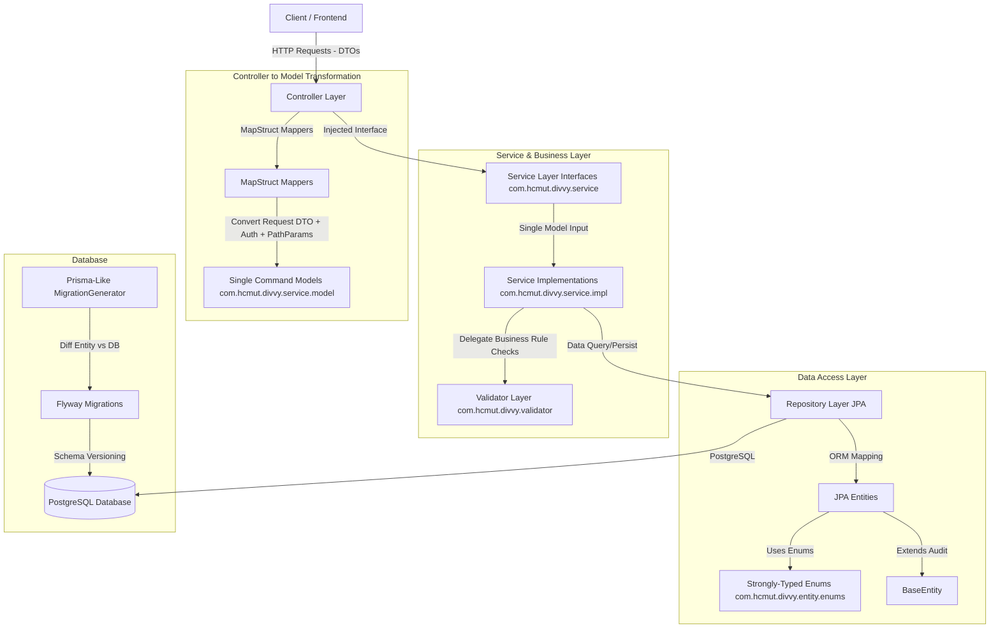

# Kiến Trúc Hệ Thống Backend (Divvy App)

Tài liệu này mô tả chi tiết kiến trúc, mô hình tổ chức source code và luồng dữ liệu của hệ thống backend Divvy.

---

## 1. Sơ đồ Kiến trúc Tổng quan (Architecture Diagram)

Hệ thống được thiết kế theo mô hình **Layered Architecture** nâng cao kết hợp **Single Model Parameter Pattern** (Command Object Pattern), **Centralized Validator Layer**, và **Strongly-Typed Enums** nhằm mục đích đảm bảo tính rõ ràng, tách biệt trách nhiệm, tránh phình to phương thức và dễ dàng mở rộng.



---

## 2. Mô tả các Layer (Layer Breakdown)

### 2.1. Controller Layer (`com.hcmut.divvy.controller`)
*   **Nhiệm vụ:** Tiếp nhận HTTP requests, xử lý validation đầu vào bằng `jakarta.validation.constraints` (thông qua `@Valid`), ánh xạ DTOs/Request Params thành Single Model đối tượng thông qua MapStruct Mapper và trả về cấu trúc response đồng nhất `ApiResponse<T>`.
*   **Nguyên tắc:** Inject trực tiếp interface `Service` tương ứng để xử lý công việc.
*   **Ví dụ:** [GroupController](file:///e:/WORKSPACE/PROJECT_WEB/khoi-nghiep/backend/main/src/main/java/com/hcmut/divvy/controller/GroupController.java)

### 2.2. Service Layer (`com.hcmut.divvy.service`)
*   **Nhiệm vụ:** Định nghĩa business interfaces tại gói gốc (`com.hcmut.divvy.service`) và thực thi business logic tại lớp Implementations (`com.hcmut.divvy.service.impl`).
*   **Cấu trúc 2 Folder Con:**
    *   `com.hcmut.divvy.service.impl`: Chứa toàn bộ các lớp Service Implementation thực thi nghiệp vụ (`AuthServiceImpl`, `GroupServiceImpl`, `GroupMemberServiceImpl`, `UserServiceImpl`, `EmailServiceImpl`).
    *   `com.hcmut.divvy.service.model`: Chứa toàn bộ các Single Command/Parameter Models (`CreateGroupModel`, `UpdateGroupModel`, `LoginModel`, `RegisterModel`, `AddMemberModel`,...).
*   **Nguyên tắc Single Model Parameter Pattern:**
    *   Mỗi phương thức của Service chỉ nhận **DUY NHẤT 1 đối tượng Model** làm tham số đầu vào (ví dụ `groupService.create(CreateGroupModel model)`), gom toàn bộ dữ liệu request body, path parameters và thông tin tài khoản đang đăng nhập.
    *   Lớp implementation được đánh dấu `@Service` và `@Transactional`. Tương tác với Repositories để đọc/ghi dữ liệu và gọi `Validator` tương ứng để kiểm tra nghiệp vụ.

### 2.3. Validator Layer (`com.hcmut.divvy.validator`)
*   **Nhiệm vụ:** Tập trung xử lý các validation mang tính trạng thái CSDL hoặc kiểm tra quyền/ràng buộc nghiệp vụ (`UserValidator`, `GroupValidator`, `GroupMemberValidator`, `PasswordResetValidator`).
*   **Mục đích:** Giúp tầng Service luôn tinh gọn, tập trung hoàn toàn vào luồng nghiệp vụ chính thay vì bị phình to bởi các đoạn code `if/else throw new Exception`.

### 2.4. Entity & Enum Layer (`com.hcmut.divvy.entity` / `com.hcmut.divvy.entity.enums`)
*   **Nhiệm vụ:** Khai báo cấu trúc bảng (ORM mapping). Tất cả các entities kế thừa từ `BaseEntity` để tự động quản lý các trường audit (`created_at`, `updated_at`) thông qua JPA Auditing.
*   **Enums:**
    *   `UserRole`: Quản lý phân quyền người dùng (`USER`, `ADMIN`).
    *   `InvitationStatus`: Quản lý trạng thái lời mời (`PENDING`, `ACCEPTED`, `DECLINED`, `EXPIRED`, `REVOKED`).
    *   `DebtStatus`: Quản lý trạng thái công nợ (`PENDING`, `SETTLED`, `CANCELLED`).

### 2.5. Repository Layer (`com.hcmut.divvy.repository`)
*   **Nhiệm vụ:** Giao tiếp trực tiếp với database. Kế thừa `JpaRepository` của Spring Data JPA.

---

## 3. Quản lý Database Schema (Database Migrations - Prisma-Like Workflow)

Hệ thống sử dụng **Flyway** kết hợp với bộ công cụ **MigrationGenerator (Prisma-like)** để tự động quản lý lịch sử và đồng bộ hóa cấu trúc cơ sở dữ liệu PostgreSQL.

Các file SQL migration được tự động đặt tại thư mục [db/migration](file:///e:/WORKSPACE/PROJECT_WEB/khoi-nghiep/backend/main/src/main/resources/db/migration) với định dạng đặt tên timestamp chuẩn: `V<YYYYMMDDHHMMSS>__<tên_migration>.sql`.

---

## 4. Luồng xử lý một Request mẫu (Request Flow Example)

Khi Client thực hiện gửi request tạo Nhóm mới (`POST /api/groups`):

```text
Client  ──► [Controller: GroupController.createGroup(request, authentication)]
                 │
                 ▼  (Validates @Valid CreateGroupRequest & Maps to Single Model)
            [GroupMapper: groupMapper.toModel(request, authentication.getName())]
                 │
                 ▼  (Passes Single CreateGroupModel)
            [Service: GroupServiceImpl.create(CreateGroupModel model)]
                 │
                 ├──► [Validator: GroupValidator.validateUserExists(model.getCurrentUsername())]
                 ├──► [Validator: GroupValidator.validateCategoryExists(model.getCategoryId())]
                 ├──► [Validator: GroupValidator.validateCurrencyExists(model.getDefaultCurrencyId())]
                 │
                 ├──► [Repository: GroupRepository.save(Group entity)]
                 ├──► [Repository: GroupMemberRepository.save(Creator as ADMIN)]
                 │
                 ▼  (Mapping Entity -> GroupResponse)
Client  ◄── [Return ApiResponse.created(groupResponse)]
```
