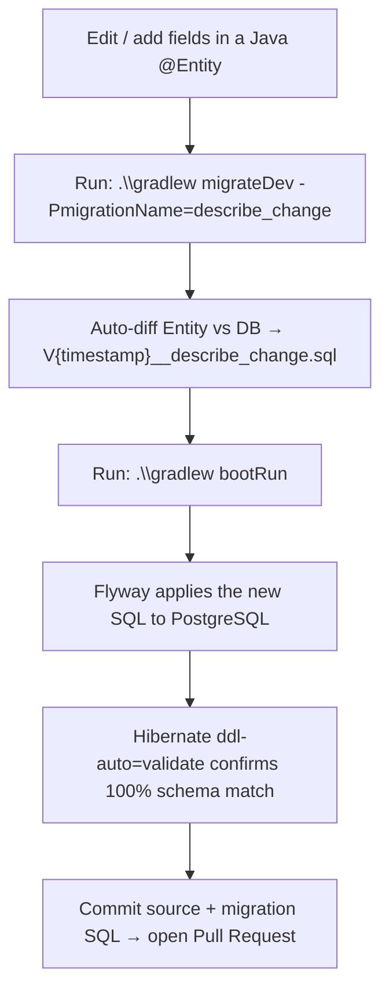

# Divvy Backend Service 💸

Backend service for **Divvy** — a group expense management system supporting expense splitting, debt tracking, and settlement recording.

---

## 🚀 Tech Stack

| Category | Technology |
|---|---|
| Language | Java 26 |
| Framework | Spring Boot `4.1.0` |
| Security | Spring Security + JWT (`jjwt 0.12.6`) |
| Data Access | Spring Data JPA + Hibernate |
| Database | PostgreSQL 16 |
| Migrations | Flyway (`flyway-core`, `flyway-database-postgresql`) |
| Mapping | MapStruct `1.6.3` |
| Code Generation | Lombok |
| Containerization | Docker + Docker Compose |
| Build Tool | Gradle |

---

## 🏗 Architecture

The system follows a **Layered Architecture** combined with the **Single Model Parameter Pattern** (Command Object Pattern), a **Pure Decoupled Validator Layer**, and **Strongly-Typed Enums**.

```text
Client / Frontend
       │  (HTTP Requests — Request DTOs)
       ▼
Controllers          (com.hcmut.divvy.controller)
       │  (MapStruct: DTO + Auth + PathParams → Single Command Model)
       ▼
Service Interfaces   (com.hcmut.divvy.service)
       │
       ▼
Service Impls        (com.hcmut.divvy.service.impl) ──► Validators (com.hcmut.divvy.validator)
  Command Models     (com.hcmut.divvy.service.model)    (Pure rule assertions — no DB access)
       │
       ▼
Repositories         (com.hcmut.divvy.repository)
       │
       ▼
Entities             (com.hcmut.divvy.entity / enums) ──► PostgreSQL Database
```

### Key Layers

**Service Layer** (`com.hcmut.divvy.service`):
- `service` — Service interface contracts.
- `service.impl` — Business logic implementations.
- `service.model` — Single command/parameter models (`CreateGroupModel`, `LoginModel`, …).

**Validator Layer** (`com.hcmut.divvy.validator`):  
Pure components — no repository injection. The service fetches data and passes entities to validators.
- `UserValidator` — Username/email uniqueness, ownership, password matching.
- `GroupValidator` — Group existence and member/owner role checks.
- `GroupMemberValidator` — Add/remove rules and last-owner protection.
- `InvitationValidator` — Send, accept, decline, and revoke rules.
- `ExpenseValidator` / `DebtValidator` / `SettlementValidator` — Domain invariants.
- `CategoryValidator` — Category existence and name uniqueness checks.
- `CurrencyValidator` — Currency existence and acronym uniqueness checks.
- `PasswordResetValidator` — Token validity, usage state, and expiry.

**Enum System** (`com.hcmut.divvy.entity.enums`):
- `UserRole` — `USER`, `ADMIN`
- `GroupRole` — `OWNER`, `MEMBER`
- `InvitationStatus` — `PENDING`, `ACCEPTED`, `DECLINED`, `EXPIRED`, `REVOKED`
- `DebtStatus` — `PENDING`, `SETTLED`
- `SplitType` — `EQUAL`, `EXACT`, `PERCENTAGE`, `SHARES`, `ADJUSTMENT`

> 📖 See [ARCHITECTURE.md](./ARCHITECTURE.md) for detailed diagrams and request-flow walkthroughs.

---

## 🛠 Getting Started

### Prerequisites
- JDK 21+ (Java 26 recommended)
- Docker & Docker Compose

### Option 1 — Docker Compose (Recommended)

Start both the database and the backend with a single command:

```bash
docker-compose up -d --build
```

The service will be available at `http://localhost:8080`.

### Option 2 — Local Dev (Gradle only)

1. Start only the database container:
   ```bash
   docker-compose up -d db
   ```
2. Run the application via Gradle Wrapper:
   ```bash
   # Windows
   .\gradlew.bat bootRun

   # Linux / macOS
   ./gradlew bootRun
   ```

### API Documentation (Swagger UI)

Once the service is running, the interactive API explorer is available at:

- **Swagger UI**: `http://localhost:8080/swagger-ui.html`
- **OpenAPI JSON**: `http://localhost:8080/v3/api-docs`

> 💡 Click **Authorize** in the Swagger UI, enter `Bearer <JWT_TOKEN>` (obtained from `POST /api/auth/login`) to authenticate all protected endpoints.

---

## 🧪 Build & Test

```bash
# Compile Java source
./gradlew compileJava

# Run tests
./gradlew test

# Build executable JAR
./gradlew bootJar
```

---

## 🔒 API Endpoints

### Public (no token required)

| Method | Path | Description |
|---|---|---|
| `POST` | `/api/auth/register` | Register a new account |
| `POST` | `/api/auth/login` | Login and obtain a JWT |
| `POST` | `/api/auth/forgot-password` | Request a password-reset email |
| `GET` | `/api/auth/reset-password/verify` | Verify a password-reset token |
| `POST` | `/api/auth/reset-password` | Set a new password |
| `GET` | `/api/categories` | List all categories |
| `GET` | `/api/categories/{id}` | Get category detail |
| `GET` | `/api/currencies` | List all currencies |
| `GET` | `/api/currencies/{id}` | Get currency detail |
| `GET` | `/actuator/**` | Health check & metrics |

### Protected (`Authorization: Bearer <JWT>` required)

| Prefix | Description |
|---|---|
| `GET /api/auth/me` | Current user profile |
| `/api/users/**` | User account management |
| `/api/groups/**` | Group management |
| `/api/groups/{id}/members/**` | Group member management |
| `/api/groups/{id}/invitations/**` | Group invitation management |
| `/api/invitations/**` | User invitation inbox & actions |
| `/api/groups/{id}/expenses/**` | Expense management |
| `/api/groups/{id}/debts/**` | Debt tracking |
| `/api/groups/{id}/settlements/**` | Settlement recording |
| `/api/categories/**` | Category creation, update, and deletion |
| `/api/currencies/**` | Currency creation, update, and deletion |

---

## 🔄 Database Migration Workflow

The project uses an **Entity-First** (Prisma-like) migration workflow. Java `@Entity` classes are the source of truth. A Gradle task diffs the entities against the live database and generates a timestamped Flyway SQL migration file.



---

## 👤 Dev Seed Data

When running with the `dev` profile, `DevDataSeeder` automatically populates sample data.

**Test accounts** (shared password: `123456`):

| Username | Email | Role |
|:---|:---|:---:|
| `hungtri` | `hung@example.com` | `USER` |
| `khanhnt` | `khanh@example.com` | `USER` |
| `anle` | `an@example.com` | `USER` |
| `binhpham` | `binh@example.com` | `USER` |
| `adminuser` | `admin@example.com` | `ADMIN` |

---

## 📚 Documentation

| Document | Description |
|---|---|
| [ARCHITECTURE.md](./ARCHITECTURE.md) | System architecture, layer diagram, request flow |
| [docs/README.md](./docs/README.md) | API specification index |
| [docs/01-auth.md](./docs/01-auth.md) | Auth API spec |
| [docs/02-user.md](./docs/02-user.md) | User API spec |
| [docs/03-group.md](./docs/03-group.md) | Group API spec |
| [docs/04-group-member.md](./docs/04-group-member.md) | Group Member API spec |
| [docs/05-invitation.md](./docs/05-invitation.md) | Invitation API spec |
| [docs/06-expense.md](./docs/06-expense.md) | Expense API spec |
| [docs/07-debt.md](./docs/07-debt.md) | Debt API spec |
| [docs/08-settlement.md](./docs/08-settlement.md) | Settlement API spec |
| [docs/09-activity.md](./docs/09-activity.md) | Activity log API spec |
| [docs/10-reference.md](./docs/10-reference.md) | Enum reference & endpoint index |
| [docs/11-category.md](./docs/11-category.md) | Category API spec |
| [docs/12-currency.md](./docs/12-currency.md) | Currency API spec |
| [docs/business/](./docs/business/) | Detailed business logic per module |
