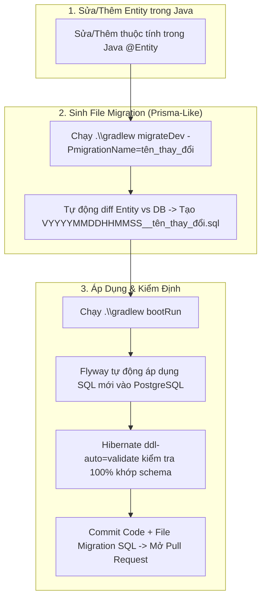

# Divvy Backend Service 💸

Backend service cho hệ thống quản lý chi tiêu nhóm, chia tiền (expense splitting), công nợ và thanh toán **Divvy**.

---

## 🚀 Công Nghệ Sử Dụng (Tech Stack)

- **Java Language**: Java 26
- **Framework**: Spring Boot `4.1.0`
- **Security**: Spring Security & JWT (`jjwt 0.12.6`)
- **Data Access**: Spring Data JPA & Hibernate
- **Database**: PostgreSQL 16
- **Database Migration**: Flyway (`flyway-core`, `flyway-database-postgresql`)
- **DTO Mapping**: MapStruct `1.6.3`
- **Code Generation**: Lombok
- **Containerization**: Docker & Docker Compose
- **Build Tool**: Gradle

---

## 🏗 Kiến Trúc Hệ Thống (Architecture)

Hệ thống tuân thủ mô hình **Layered Architecture** kết hợp với **Facade Pattern**:

```
Client / Frontend
       │ (HTTP Requests)
       ▼
Controllers (`com.hcmut.divvy.controller`)
       │ (100% Facade-Centric)
       ▼
Facades (`com.hcmut.divvy.facade`)
       │ (Phân giải động qua BaseFacade -> Spring ApplicationContext)
       ▼
Services (`com.hcmut.divvy.service`) ──► Validators (`com.hcmut.divvy.validator`)
       │
       ▼
Repositories (`com.hcmut.divvy.repository`)
       │
       ▼
Entities (`com.hcmut.divvy.entity`) ──► PostgreSQL Database
```

> 📖 Chi tiết sơ đồ kiến trúc và luồng xử lý request mẫu xem tại [ARCHITECTURE.md](file:///e:/WORKSPACE/PROJECT_WEB/khoi-nghiep/backend/main/ARCHITECTURE.md).

---

## 🛠 Hướng Dẫn Khởi Chạy

### 1. Yêu Cầu Tiền Đề (Prerequisites)
- JDK 21+ (Khuyến nghị Java 26)
- Docker & Docker Compose

### 2. Chạy Bằng Docker Compose (Khuyên dùng)
Khởi chạy cả Database (PostgreSQL) và Backend service chỉ với 1 lệnh:

```bash
docker-compose up -d --build
```

Dịch vụ backend sẽ hoạt động tại: `http://localhost:8080`

### 3. Chạy Trong Môi Trường Phát Triển (Local Dev)
1. Khởi chạy riêng container Database:
   ```bash
   docker-compose up -d db
   ```
2. Khởi chạy ứng dụng bằng Gradle Wrapper:
   - **Windows:**
     ```cmd
     .\gradlew.bat bootRun
     ```
   - **Linux / macOS:**
     ```bash
     ./gradlew bootRun
     ```

---

## 🧪 Biên Dịch & Kiểm Thử

- **Biên dịch Java code**:
  ```bash
  ./gradlew compileJava
  ```
- **Chạy Tests**:
  ```bash
  ./gradlew test
  ```
- **Tạo bản đóng gói JAR**:
  ```bash
  ./gradlew bootJar
  ```

---

## 🔒 API Endpoints & Authorization

- **Public Endpoints** (Không yêu cầu Token):
  - `POST /api/auth/register` - Đăng ký tài khoản
  - `POST /api/auth/login` - Đăng nhập lấy JWT Bearer Token
  - `/actuator/**` - System health check & metrics
  - `/error` - Standard error responses
- **Protected Endpoints** (Yêu cầu `Authorization: Bearer <JWT>`):
  - Tất cả các API còn lại (`/api/users/**`, `/api/groups/**`, `/api/expenses/**`, ...)

---

## 🔄 Quy Trình Phát Triển CSDL (Prisma-Like Entity-First Development Workflow)

Dự án áp dụng quy trình phát triển CSDL **Prisma-like Entity-First**: Coi các class Java `@Entity` là nguồn chuẩn (Source of Truth). Công cụ tự động so sánh sự chênh lệch (Diff) giữa Java `@Entity` và PostgreSQL thực tế để sinh ra file SQL Migration theo Timestamp.



### 📋 Các câu lệnh thường dùng cho Dev:

1. **Khi có thay đổi ở Java `@Entity` (Tự động sinh file Migration SQL)**:
   - **Windows:**
     ```powershell
     .\gradlew.bat migrateDev -PmigrationName=add_user_avatar
     ```
   - **Linux / macOS:**
     ```bash
     ./gradlew migrateDev -PmigrationName=add_user_avatar
     ```
   *(Tự động quét diff giữa Entity Java và DB PostgreSQL đang chạy, sinh file timestamp: `src/main/resources/db/migration/VYYYYMMDDHHMMSS__add_user_avatar.sql`)*

2. **Chạy ứng dụng (Flyway nạp migration & Hibernate validate schema)**:
   - **Windows:**
     ```powershell
     .\gradlew.bat bootRun
     ```
   - **Linux / macOS:**
     ```bash
     ./gradlew bootRun
     ```
   *(Mặc định `application-dev.yml` tự động chạy Flyway migrate và Hibernate `ddl-auto=validate`)*

3. **Ghi đè chế độ kiểm định (nếu cần)**:
   ```powershell
   .\gradlew.bat bootRun --args='--spring.jpa.hibernate.ddl-auto=validate'
   ```

---

## 👤 Dữ Liệu Khởi Tạo Mẫu (Dev Seed Data)

Môi trường phát triển (`profile: dev`) có sẵn bộ khởi tạo dữ liệu tự động thông qua `DevDataSeeder`.

### 🔑 Các tài khoản test có sẵn (Mật khẩu chung: `123456`):
| Username | Email | Role | Mật khẩu |
| :--- | :--- | :---: | :---: |
| `hungtri` | `hung@example.com` | `USER` | `123456` |
| `khanhnt` | `khanh@example.com` | `USER` | `123456` |
| `anle` | `an@example.com` | `USER` | `123456` |
| `binhpham` | `binh@example.com` | `USER` | `123456` |
| `adminuser` | `admin@example.com` | `ADMIN` | `123456` |

### 📊 Dữ liệu nghiệp vụ thử nghiệm có sẵn:
- **Nhóm (Groups)**: *Chuyến đi Đà Lạt* (4 thành viên), *Tiền nhà chung cư* (2 thành viên).
- **Chi phí (Expenses)**: Đặt khách sạn, ăn uống, thuê xe máy, tiền điện nước,...
- **Công nợ & Lịch sử**: Công nợ chia đều (`debts`), lịch sử thanh toán qua ngân hàng (`settlements`), nhật ký hoạt động (`activities`).
