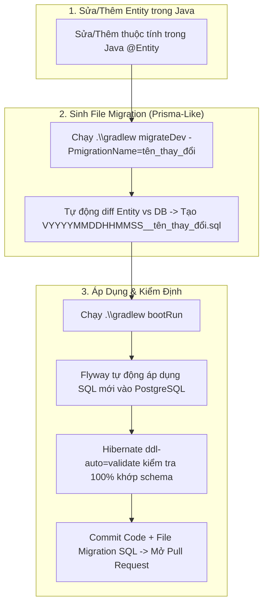

# Divvy Backend Service 💸

Backend service cho hệ thống quản lý chi tiêu nhóm, chia tiền (expense splitting), công nợ và thanh toán **Divvy**.

---

## 🚀 Công Nghệ Sử Dụng (Tech Stack)

- **Java Language**: Java 26
- **Framework**: Spring Boot `4.1.0`
- **Security**: Spring Security & JWT (`jjwt 0.12.6`)
- **Data Access**: Spring Data JPA & Hibernate
- **Database**: PostgreSQL 16
- **Database Migration**: Flyway (`flyway-core`, `flyway-database-postgresql`)
- **DTO & Model Mapping**: MapStruct `1.6.3`
- **Code Generation**: Lombok
- **Containerization**: Docker & Docker Compose
- **Build Tool**: Gradle

---

## 🏗 Kiến Trúc Hệ Thống (Architecture)

Hệ thống tuân thủ mô hình **Layered Architecture** chuẩn kết hợp với **Single Model Parameter Pattern** (Command Object Pattern), **Pure Decoupled Validator Layer**, và **Strongly-Typed Enums**:

```text
Client / Frontend
       │ (HTTP Requests - Request DTOs)
       ▼
Controllers (`com.hcmut.divvy.controller`)
       │
       │ (MapStruct: DTO + Auth + PathParams ──► Single Model)
       ▼
Service Interfaces (`com.hcmut.divvy.service`)
       │
       ▼
Service Implementations (`com.hcmut.divvy.service.impl`) ──► Pure Validators (`com.hcmut.divvy.validator`)
  (Models: `com.hcmut.divvy.service.model`)                 (Pure Rule Assertions)
       │
       ▼
Repositories (`com.hcmut.divvy.repository`)
       │
       ▼
Entities (`com.hcmut.divvy.entity` / `enums`) ──► PostgreSQL Database
```

### 📁 Cấu Trúc Gói Tầng Service (`com.hcmut.divvy.service`):
- `com.hcmut.divvy.service`: Chứa toàn bộ các Interface Service contract (`AuthService`, `GroupService`, `GroupMemberService`, `UserService`, `EmailService`, `InvitationService`).
- `com.hcmut.divvy.service.impl`: Chứa toàn bộ các lớp Service Implementation thực thi nghiệp vụ (`AuthServiceImpl`, `GroupServiceImpl`, `GroupMemberServiceImpl`, `UserServiceImpl`, `InvitationServiceImpl`, `EmailServiceImpl`).
- `com.hcmut.divvy.service.model`: Chứa toàn bộ các Single Command/Parameter Models (`CreateGroupModel`, `UpdateGroupModel`, `LoginModel`, `RegisterModel`, `AddMemberModel`,...).

### 🛡️ Tầng Xác Thực Nghiệp Vụ Thuần (`com.hcmut.divvy.validator`):
Các Validator đóng vai trò **Pure Component** (không tự inject Repository hay truy xuất Database). Tầng Service chịu trách nhiệm lấy dữ liệu từ DB và chuyển cho Validator thực hiện kiểm tra:
- `UserValidator`: Kiểm tra quy tắc trùng lặp username/email, sở hữu tài khoản và khớp mật khẩu.
- `GroupValidator`: Xác thực điều kiện thành viên/quyền Admin trên đối tượng `GroupMember`.
- `GroupMemberValidator`: Kiểm tra quy tắc thêm/xóa thành viên, phân quyền và bảo vệ vị trí Admin cuối cùng.
- `InvitationValidator`: Xác thực quy tắc gửi, chấp nhận, từ chối hoặc thu hồi lời mời.
- `PasswordResetValidator`: Kiểm tra tính hợp lệ, trạng thái sử dụng và thời hạn của token reset mật khẩu.

### 🏷️ Hệ Thống Enums Định Kiểu Mạnh (`com.hcmut.divvy.entity.enums`):
- `UserRole`: Phân quyền người dùng hệ thống (`USER`, `ADMIN`).
- `InvitationStatus`: Trạng thái lời mời tham gia nhóm (`PENDING`, `ACCEPTED`, `DECLINED`, `EXPIRED`, `REVOKED`).
- `DebtStatus`: Trạng thái ghi nợ giữa các thành viên (`PENDING`, `SETTLED`, `CANCELLED`).

> 📖 Chi tiết sơ đồ kiến trúc và luồng xử lý request mẫu xem tại [ARCHITECTURE.md](file:///e:/WORKSPACE/PROJECT_WEB/khoi-nghiep/backend/main/ARCHITECTURE.md).

---

## 🛠 Hướng Dẫn Khởi Chạy

### 1. Yêu Cầu Tiền Đề (Prerequisites)
- JDK 21+ (Khuyến nghị Java 26)
- Docker & Docker Compose

### 2. Chạy Bằng Docker Compose (Khuyên dùng)
Khởi chạy cả Database (PostgreSQL) và Backend service chỉ với 1 lệnh:

```bash
docker-compose up -d --build
```

Dịch vụ backend sẽ hoạt động tại: `http://localhost:8080`

### 📘 Tài Liệu API Swagger UI (OpenAPI Docs)
Sau khi khởi chạy backend, truy cập giao diện thử nghiệm API trực quan Swagger UI tại:
- **Swagger UI**: `http://localhost:8080/swagger-ui.html`
- **OpenAPI JSON Spec**: `http://localhost:8080/v3/api-docs`

> 💡 *Hướng dẫn thử nghiệm trên Swagger UI*: Bấm vào nút **Authorize** ở góc phải giao diện Swagger, nhập `Bearer <JWT_TOKEN>` (thu được từ API `/api/auth/login`) để gọi thử tất cả các API Protected dễ dàng.

### 3. Chạy Trong Môi Trường Phát Triển (Local Dev)
1. Khởi chạy riêng container Database:
   ```bash
   docker-compose up -d db
   ```
2. Khởi chạy ứng dụng bằng Gradle Wrapper:
   - **Windows:**
     ```cmd
     .\gradlew.bat bootRun
     ```
   - **Linux / macOS:**
     ```bash
     ./gradlew bootRun
     ```

---

## 🧪 Biên Dịch & Kiểm Thử

- **Biên dịch Java code**:
  ```bash
  ./gradlew compileJava
  ```
- **Chạy Tests**:
  ```bash
  ./gradlew test
  ```
- **Tạo bản đóng gói JAR**:
  ```bash
  ./gradlew bootJar
  ```

---

## 🔒 API Endpoints & Authorization

- **Public Endpoints** (Không yêu cầu Token):
  - `POST /api/auth/register` - Đăng ký tài khoản
  - `POST /api/auth/login` - Đăng nhập lấy JWT Bearer Token
  - `POST /api/auth/forgot-password` - Quên mật khẩu
  - `GET /api/auth/reset-password/verify` - Kiểm tra token reset mật khẩu
  - `POST /api/auth/reset-password` - Đặt lại mật khẩu mới
  - `/actuator/**` - System health check & metrics
  - `/error` - Standard error responses
- **Protected Endpoints** (Yêu cầu `Authorization: Bearer <JWT>`):
  - `GET /api/auth/me` - Lấy thông tin user hiện tại
  - `/api/users/**` - Quản lý tài khoản người dùng
  - `/api/groups/**` - Quản lý nhóm chi tiêu
  - `/api/groups/{groupId}/members/**` - Quản lý thành viên nhóm

---

## 🔄 Quy Trình Phát Triển CSDL (Prisma-Like Entity-First Development Workflow)

Dự án áp dụng quy trình phát triển CSDL **Prisma-like Entity-First**: Coi các class Java `@Entity` là nguồn chuẩn (Source of Truth). Công cụ tự động so sánh sự chênh lệch (Diff) giữa Java `@Entity` và PostgreSQL thực tế để sinh ra file SQL Migration theo Timestamp.



---

## 👤 Dữ Liệu Khởi Tạo Mẫu (Dev Seed Data)

Môi trường phát triển (`profile: dev`) có sẵn bộ khởi tạo dữ liệu tự động thông qua `DevDataSeeder`.

### 🔑 Các tài khoản test có sẵn (Mật khẩu chung: `123456`):
| Username | Email | UserRole | Mật khẩu |
| :--- | :--- | :---: | :---: |
| `hungtri` | `hung@example.com` | `USER` | `123456` |
| `khanhnt` | `khanh@example.com` | `USER` | `123456` |
| `anle` | `an@example.com` | `USER` | `123456` |
| `binhpham` | `binh@example.com` | `USER` | `123456` |
| `adminuser` | `admin@example.com` | `ADMIN` | `123456` |
